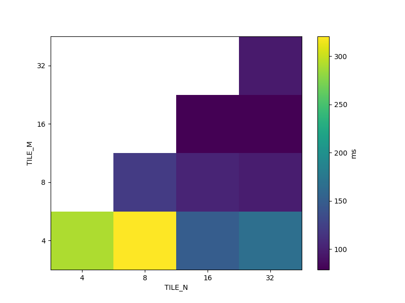
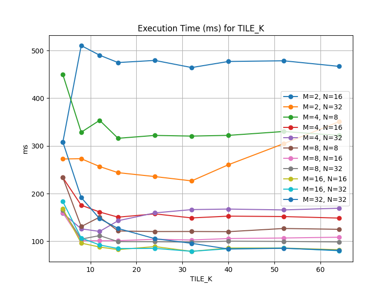
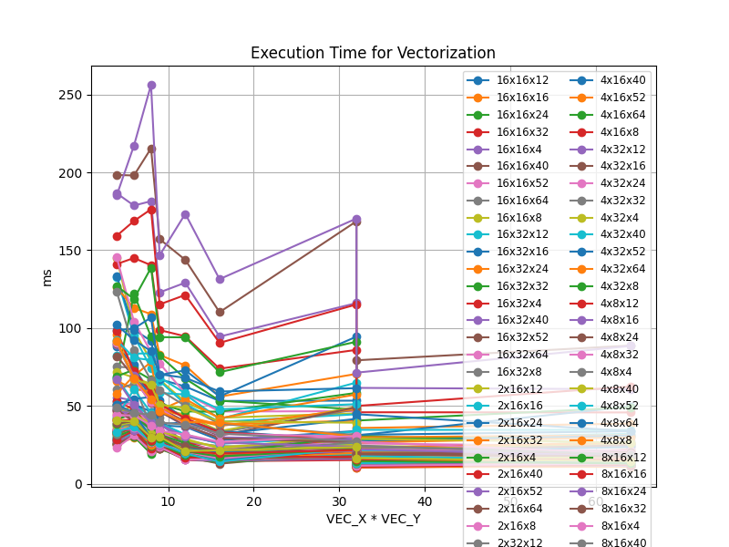
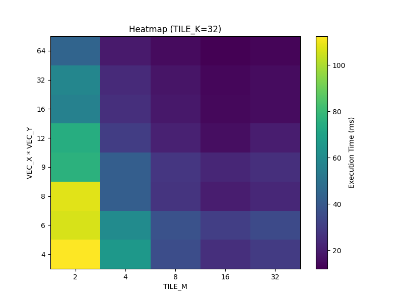
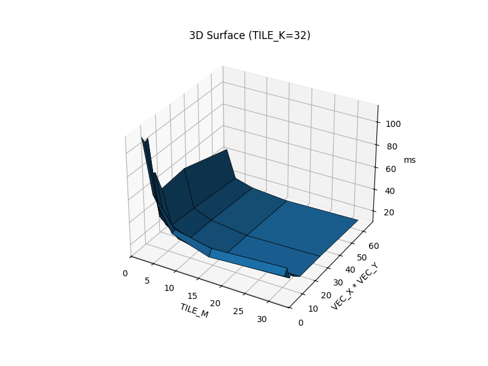
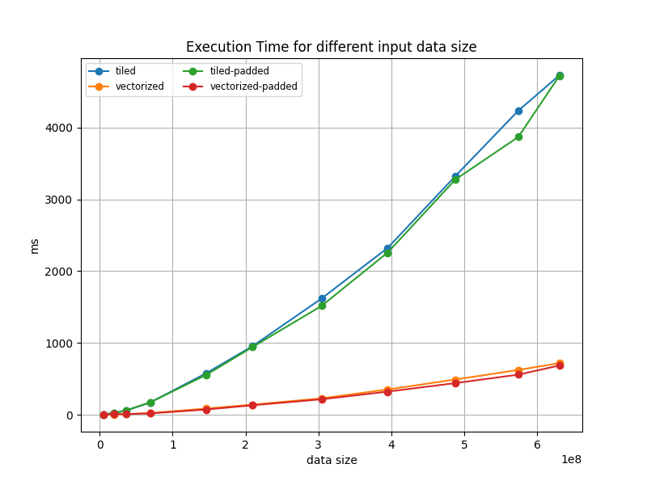

| Лабораторная работа №1.1   |  М3237                   | Программирование на видеокартах |
| :------------------------- | ------------------------ | ------------------------------- |
| MatMul.CUDA                | Смирнов Даниил Сергеевич | 2025                            |

## Характеристики тестового стенда
| Name       | Driver Version | CUDA Version |
|------------|----------------|--------------|
| RTX 3080ti | 572.61         | 12.8         |

## Реализации умножения
- На процессоре с использовением OpenMP
- На видеокарте с использованием `shared` памяти (обработка по одному элементу результирующей матрицы в каждом потоке)
- На видеокарте с использованием `shared` памяти и векторизации (обработки нескольких элементов результирующей матрицы в одном потоке)
- А также обе версии на видеокарте, но с выравниванием матриц, чтобы не было ветвлений в `kernel` коде.

## Результаты
```
unsigned int n = 3159, k = 6385, m = 4987;
```
### Результаты версии только с тайлингом
[tile-results.csv](report/tile-results.csv)





Наиболее быстрая конфигурация:

| TILE_M | TILE_N | TILE_K | Время (ms) |
|:------:|:------:|:------:|:----------:|
|   16   |   16   |   32   |    78.79   |

### Результаты векторизации
[vector-results.csv](report/vector-results.csv)







Наиболее быстрая конфигурация с векторизацией:

| VEC_X | VEC_Y | TILE_M | TILE_N | TILE_K | Время (ms) |
|:-----:|:-----:|:------:|:------:|:------:|:----------:|
|   4   |   8   |   16   |   16   |   32   |   10.44    |

**Ускорение** алгоритма при векторизации по сравнению с обычным тайлингом составляет примерно \(78.79 / 10.44 \approx 7.55x\).

## Результаты обоих версий (+ выравненных) на разных данных
[sizes-results2.csv](report/sizes-results2.csv)



## Интересные наблюдения
- В стандартном заголовочном файле максимальный объявленный векторным тип - `float4`.
  Из профайлера Nsight Compute я выяснил, что даже при векторизации 4x4 потоки недостаточно загружены, 
  и было принято решение протестировать на `float8`, что и дало оптимальное время работы, несмотря на то, 
  что это дает ускорение только из-за коичества обрабатываемых эелементов.
- Если использовать `__ldg()` для загрузки данных из глобальной памяти, 
  то они пойдут в обход L1 кэша и будут загружены через read-only кэш. 
  Этого эффекта можно добиться помечая данные как `const __restrict__`, 
  но это лишь подсказывает компилятору возможную оптимизацию, но не гарантирует её применение.
- `#pragma unroll` так же ускоряет время работы программы, 
  так как помогает компилятору убрать расходы на управление циклом и повысить instruction-level-parallelism.
  `nvcc` сам применяет эту оптимизацию для "небольших" циклов. Я добавил эту директиву везде, но кажется 
  она имеет смысл только в двойных и тройных циклах. 

## Выводы
- Вероятно наболее оптимальная конфигурация для плиток такова (16x32 и 32x16), 
  потому что средний параметр не влияет на размер блока $16*16=256$, но позволяет использовать больше `shared` памяти.
  Оптимальный `TILE_M` = `TILE_N` скорее всего из-за тогов что, я проверял на сопоставимых размерах для `m` и `n`.
  Скорее всего оптимальное соотношение должно соответствовать соотношению сторон исходных матриц, 
  но так как тогда требуется перекомпиляция программы для каждых новых входных данных, я решил, что стоит оставить как есть,
  что кажется в среднем будет лучше.
- Векторизация значительно снизила время работы, что видно на последнем графике, 
  так как теперь используется больше доустпуных ресурсов, потому что
  каждый поток теперь обрабатывает сразу несколько элементов итоговой матрицы.
  Я думаю оптимальные гиперпараметры такие - 4 и 8, а не например 2 или 3, 
  из-за выравнивани и более равномерного обращения к банкам памяти, 
  но не больше, потому что достигается максимальная производительность потоков.
- Реализации с выравниванием дали небольшой прирост в скорости за счет того, 
  что на границых матриц теперь не выполняются обе ветки if'ов. 
  При выборе реализаций 1 и 2 теперь вызываются именно они.


