| Лабораторная работа №1.2   |  <Группа>   | Программирование на видеокартах | 
| :------------------------- | ----------- | ------------------------------- |
| MatMul.OpenCL              | Смирнов Даниил Сергеевич | 2025                            |

## Характеристики тестового стенда
| Name       | Driver Version | CUDA Version |
|------------|----------------|--------------|
| RTX 3080ti | 572.61         | 12.8         |

## Реализации умножения
- На процессоре с использовением OpenMP
- На видеокарте с использованием `local` памяти (обработка по одному элементу результирующей матрицы в каждом потоке)
- На видеокарте с использованием `local` памяти и векторизации (обработки нескольких элементов результирующей матрицы в одном потоке)
- А также обе версии на видеокарте, но с выравниванием матриц, чтобы не было ветвлений в `kernel` коде.

## Результаты
```
unsigned int n = 3159, k = 6385, m = 4987;
```
### Результаты версии только с тайлингом
[results-tile.csv](report/results-tile.csv)

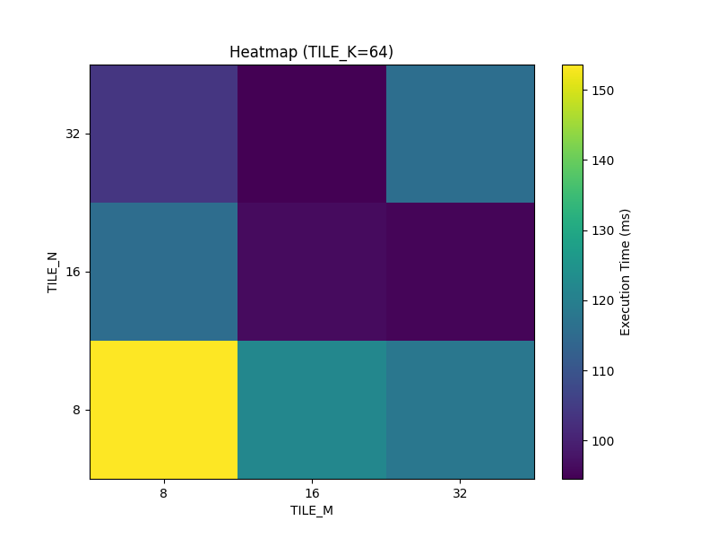

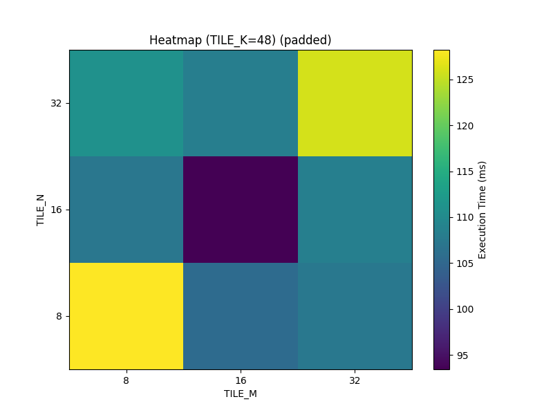

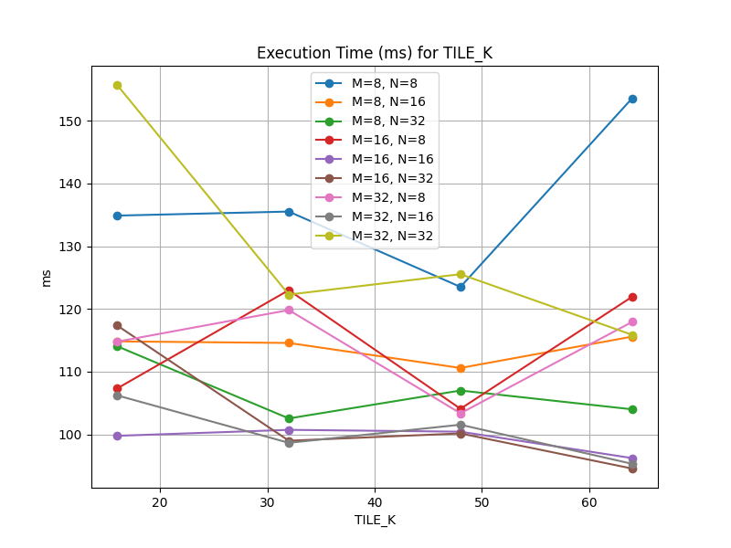

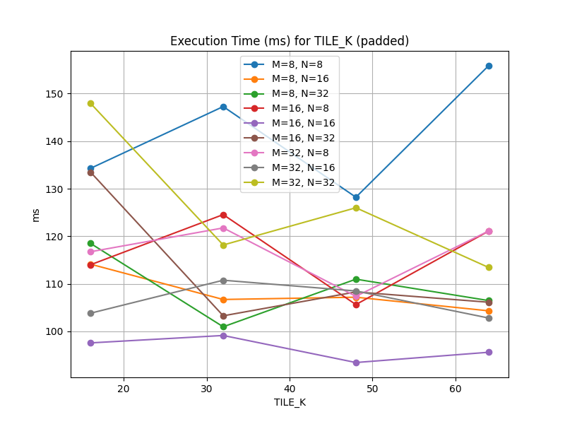

Наиболее быстрая конфигурация:

|TILE_M  | TILE_N | TILE_K |     ms  |
|--------|--------|--------|---------|
|     16 |     32 |     64 | 94.5592 |

Наиболее быстрая конфигурация для выровненных данных:
|TILE_M  |TILE_N  |TILE_K  |ms       |
|--------|--------|--------|---------|
|    16  |    16  |    48  |  93.4368|

### Результаты векторизации
[results-vector.csv](report/results-vector.csv)

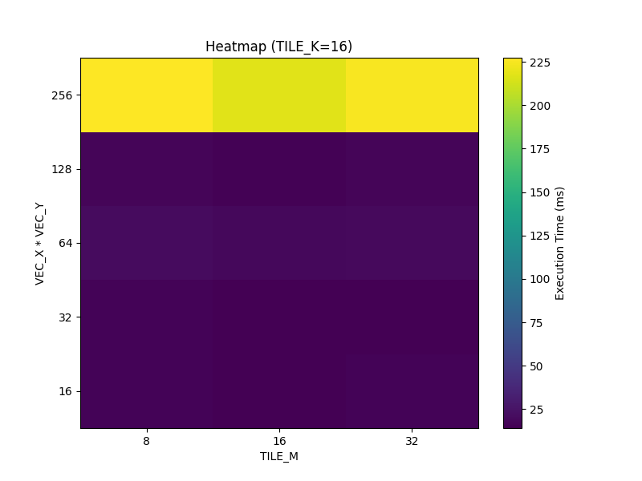

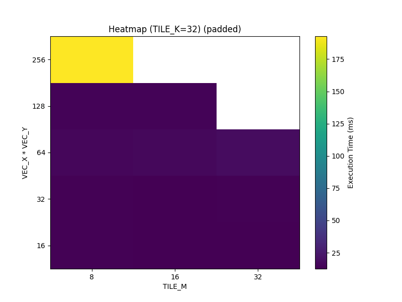

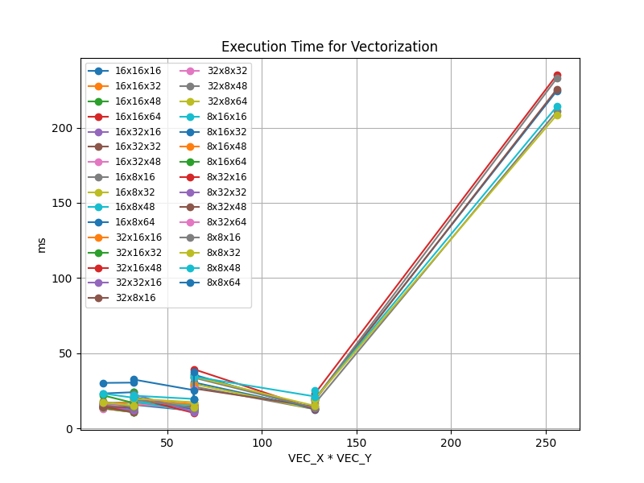

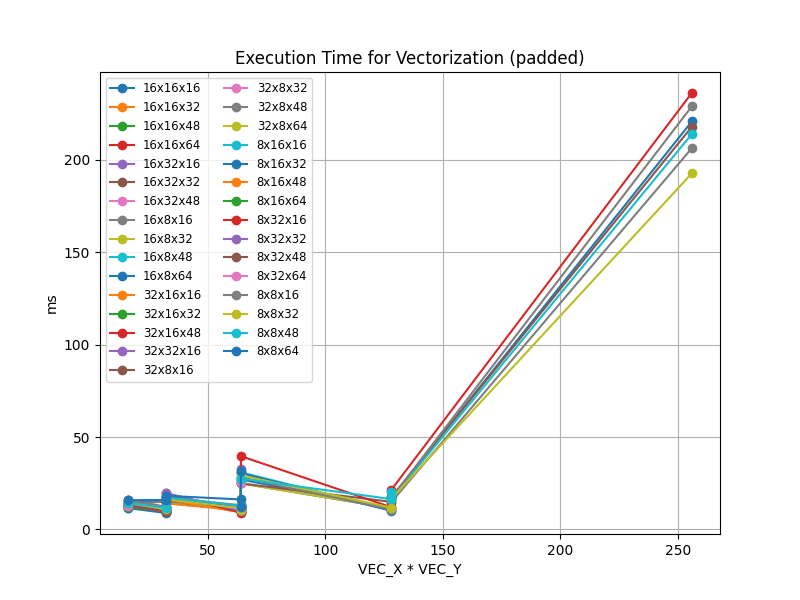

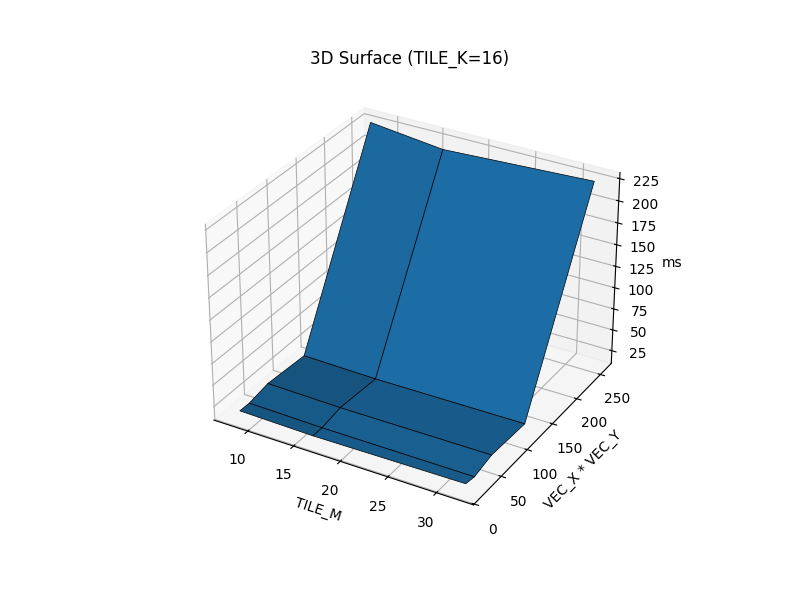

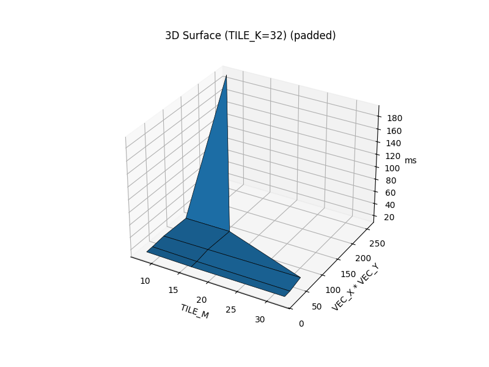

Наиболее быстрая конфигурация с векторизацией:

| VEC_X | VEC_Y | TILE_M | TILE_N | TILE_K | Время (ms) |
|:-----:|:-----:|:------:|:------:|:------:|:----------:|
|   4   |   16  |   8    |   32   |   16   |   10.3383  |

Наиболее быстрая конфигурация с векторизацией на выравненных данных:

| VEC_X | VEC_Y | TILE_M | TILE_N | TILE_K | Время (ms) |
|:-----:|:-----:|:------:|:------:|:------:|:----------:|
|   4   |   8   |   8    |   16   |   32   |   8.92518  |

## Результаты обоих версий (+ выравненных) на разных данных
[sizes-results2.csv](report/results-size.csv)

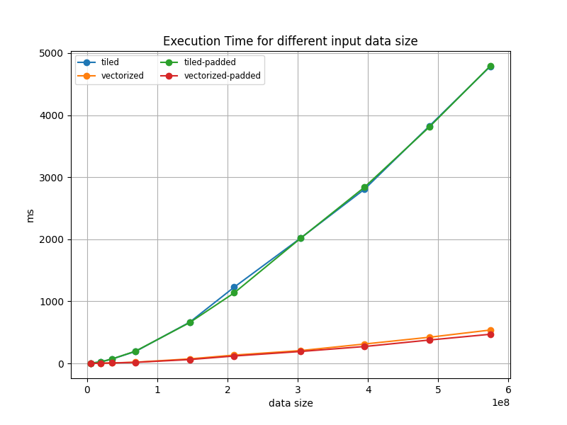

## Выводы
- Возникла проблема, что полученные в результате эксперимента гиперпараметры,
  максимально подходящие для моей видеокарты, превышали ограничения девайсов из тестов,
  что не было очевидно из кода ошибки и на что было потрачено много времени и просрочен дедлайн :(
  Самое оптимально решение, которое я придумал - просто брать минимум из оптимальных и доступных и подгонять под максимум.
- В этот раз для каждой версии оптимальные конфигурации оказались разными, 
  но и результат для 2 версии стал лучше по сравнению с CUDA.
- На некоторых хитмапах стало более отчетливо видно лучшие варианты.
- А в остальном выводе те же, что и в предыдущей лабораторной.
