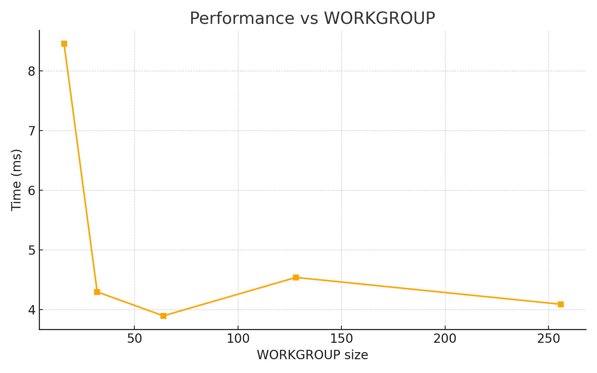
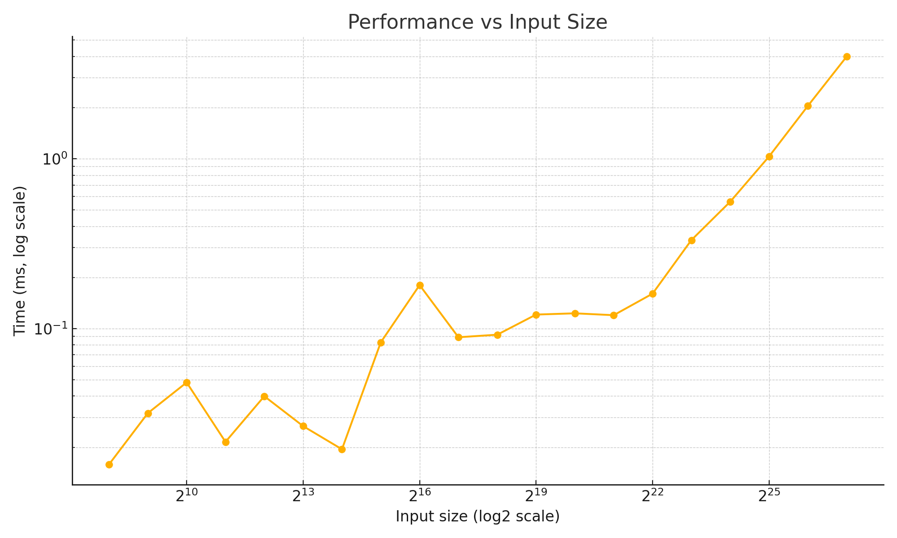

| Лабораторная работа №2     |  М3237                   | Программирование на видеокартах |
| :------------------------- | ------------------------ | ------------------------------- |
| PrefSum.OpenCL             | Смирнов Даниил Сергеевич | 2025                            |

# Алгоритм

Алгоритм построен на рекурсивной двуфазной схеме с использованием двух ядер (вариации на тему алгоритма Blelloch'а):
- `sum_block` — выполняет префиксную сумму (`scan`) внутри каждого блока (`WORKGROUP`) и сохраняет суммы блоков в промежуточный буфер.
- `sum_add` — добавляет префиксные суммы предыдущих блоков к каждому элементу блока на следующем уровне.

Рекурсивная стратегия
- Делим массив на блоки длины 2 * `WORKGROUP`.
- Выполняем scan для каждого блока (sum_block) и записываем сумму последнего элемента каждого блока во временный буфер.
- Рекурсивно применяем scan к этому буферу.
- Добавляем полученные суммы ко всем элементам блоков, начиная со второго (`sum_add`).

Лучший размер - 64.

# Выводы
Алгоритм демонстрирует логарифмическую сложность по времени (примерно $$O(log n)$$), как и ожидалось от рекурсивного подхода.
